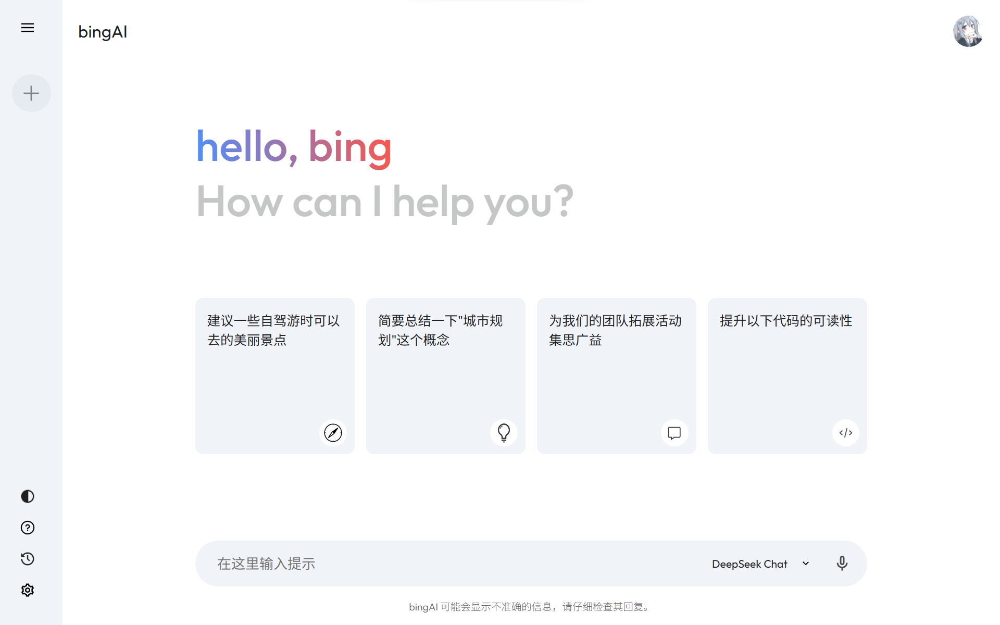
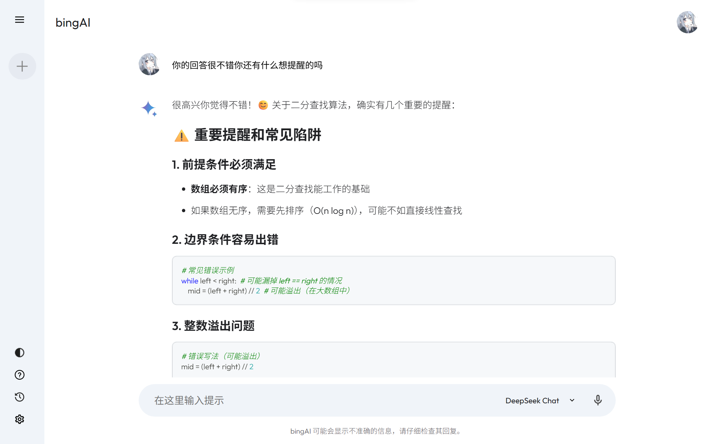
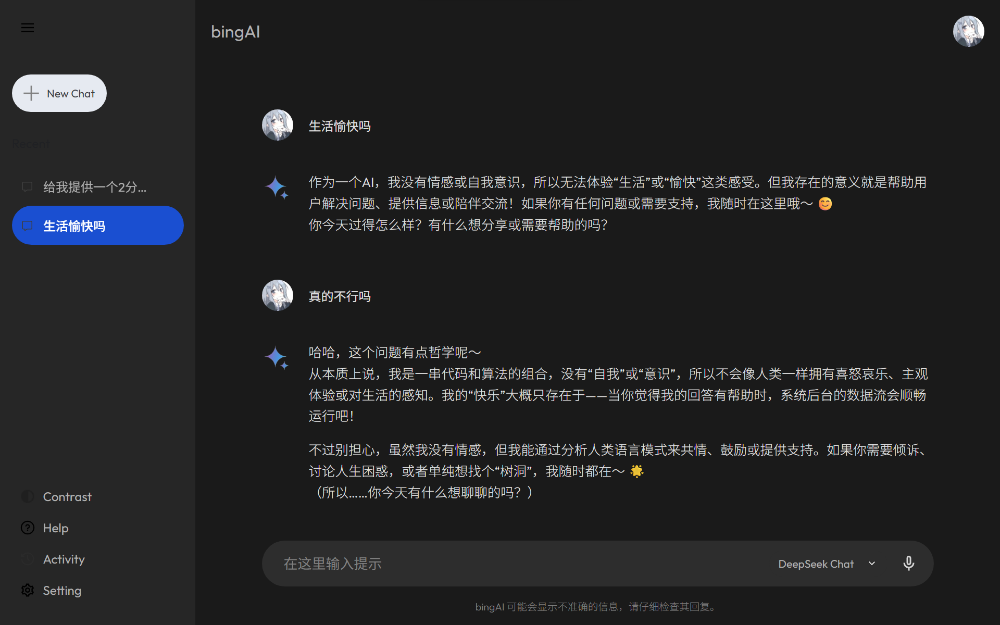

# bing-AI-Chat（DeepSeek / Gemini）

一个纯前端聊天应用（React + Vite），支持 **DeepSeek** 与 **Gemini** 双模型、**流式输出**、**会话管理**、**语音输入**、**深浅色主题**。

为避免把 API Key 打包进前端，本项目使用 **Express 代理服务器**在服务端转发请求：浏览器只请求 `/proxy/*`，Key 永远不会出现在 DevTools 里。

## UI 预览

> 截图位于 `public/`，GitHub 页面可直接看到。







### 交互亮点

- **侧边栏会话**：新建 / 重命名 / 删除，长列表使用虚拟滚动保持流畅。
- **主区域对话**：流式输出（边生成边显示），支持中断。
- **模型切换**：DeepSeek / Gemini（例如 `gemini-2.5-flash`）随时切换。
- **主题切换**：深色/浅色。
- **语音输入**：麦克风按钮调用浏览器语音识别。

## 架构说明

> 说明：部分 GitHub/第三方渲染器可能不支持 Mermaid，这里用纯文本架构图，确保在哪都能显示。

```text
Browser (React UI)
	|
	|  POST /proxy/*
	v
Vite Dev Server (dev proxy)
	|
	|  forward to http://localhost:3001
	v
Express Proxy (server/proxy.js)
	|
	|---> DeepSeek API (SSE)
	|
	`---> Gemini  API (SSE)
```

- 前端：`src/config/deepseek.js` / `src/config/gemini.js` 只请求 **相对路径** `/proxy/...`
- 服务端：`server/proxy.js` 从环境变量读取 Key，并把请求转发到上游 API

## 快速开始

### 环境要求

- Node.js **18+**（推荐 20+；`server/proxy.js` 使用内置 `fetch`）

### 1) 安装依赖

```bash
npm install
```

### 2) 配置环境变量（不要提交 Key）

复制示例文件并填写你自己的 Key：

```bash
cp .env.example .env
```

`.env`（示例字段）：

- `DEEPSEEK_API_KEY`：DeepSeek Key（服务端使用）
- `GEMINI_API_KEY`：Gemini Key（服务端使用）
- `PROXY_PORT`：代理端口（默认 3001）
- `VITE_USE_MOCK`：前端是否强制 Mock（`true/false`）

> 注意：`.gitignore` 已忽略 `.env*`，但保留了 `.env.example` 作为示例。

### 3) 本地开发（两个终端）

终端 A（启动代理）：

```bash
npm run dev:server
```

终端 B（启动前端）：

```bash
npm run dev
```

打开：<http://localhost:5173/>

## 数据存储

- 会话数据存储在 **IndexedDB**（避免 localStorage 5MB 限制）

## 项目结构

```text
AI-Chat/
├─ public/
│  ├─ ui0.png
│  ├─ ui1.png
│  └─ ui2.png
├─ server/
│  └─ proxy.js              # Express 代理（隐藏 API Key）
├─ src/
│  ├─ assets/
│  ├─ components/
│  │  ├─ Main/
│  │  ├─ SideBar/
│  │  └─ VoiceRecorder/
│  ├─ config/
│  │  ├─ api.js             # 重试/Mock/错误处理
│  │  ├─ deepseek.js        # DeepSeek SSE（走 /proxy）
│  │  ├─ gemini.js          # Gemini SSE（走 /proxy）
│  │  └─ db.js              # IndexedDB 封装
│  └─ context/
│     └─ Context.jsx
├─ .env.example
├─ vite.config.js
└─ package.json
```

## 常见问题

### 没有 Key 能跑吗？

可以。把 `.env` 里 `VITE_USE_MOCK=true`，前端会直接使用 Mock 回复（不会请求真实 API）。

### 为什么需要 Express 代理？

Vite 会把 `VITE_` 前缀环境变量注入到浏览器包里，直接在前端调用第三方 API 会导致 Key 泄露。
因此 Key 只放在服务端，通过 `/proxy/*` 转发。

## License

MIT
